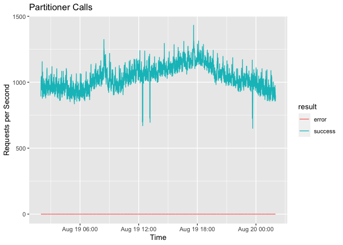

<!-- README.md is generated from README.Rmd. Please edit that file -->

# promr

`promr` is a
[PromQL](https://prometheus.io/docs/prometheus/latest/querying/basics/)
query client for the [Prometheus](https://prometheus.io/) time-series
database.

## Installation

To install the development version using `devtools`:

``` r
devtools::install_github("domodwyer/promr")
```

## Example

``` r
library(promr)

# Define your PromQL query
q <- "sum by (handler, result) (rate(dml_handler_write_duration_seconds_count{}[1m]))"

# And execute the query within the specified time range
df <- query_range(
  q,
  "2022-08-19T00:00:00Z",
  "2022-08-20T00:00:00Z"
)
```

Timestamps can be provided as `rfc3339` strings, numerical unix
timestamps, or `POSIXct`. Optionally timeout, and step parameters can be
provided.

The output `df` contains all the returned series, with the measurements
nested within. For this query, there are 10 series:

``` r
print(df)
## # A tibble: 10 × 3
##    handler              result  values              
##    <chr>                <chr>   <list>              
##  1 parallel_write       error   <tibble [8,641 × 2]>
##  2 parallel_write       success <tibble [8,641 × 2]>
##  3 partitioner          error   <tibble [8,641 × 2]>
##  4 partitioner          success <tibble [8,641 × 2]>
##  5 request              error   <tibble [8,641 × 2]>
##  6 request              success <tibble [8,641 × 2]>
##  7 schema_validator     error   <tibble [8,641 × 2]>
##  8 schema_validator     success <tibble [8,641 × 2]>
##  9 sharded_write_buffer error   <tibble [8,641 × 2]>
## 10 sharded_write_buffer success <tibble [8,641 × 2]>
```

The unnested data can be easily extracted using `tidyr::unnest()` (part
of of the `tidyverse`), to produce a “long” tibble of measurements:

``` r
df |>
  tidyr::unnest(values) |>
  head()
## # A tibble: 6 × 4
##   handler        result timestamp           value
##   <chr>          <chr>  <dttm>              <dbl>
## 1 parallel_write error  2022-08-19 02:00:00     0
## 2 parallel_write error  2022-08-19 02:00:10     0
## 3 parallel_write error  2022-08-19 02:00:20     0
## 4 parallel_write error  2022-08-19 02:00:30     0
## 5 parallel_write error  2022-08-19 02:00:40     0
## 6 parallel_write error  2022-08-19 02:00:50     0
```

Which makes it easy to work on, and visualise the actual data:

``` r
library(ggplot2)
library(tidyverse)

df |>
  unnest(values) |>
  filter(handler == "partitioner") |>
  ggplot(aes(x = timestamp, y = value, colour = result)) +
  geom_line() +
  labs(
    title = "Partitioner Calls",
    x = "Time",
    y = "Requests per Second"
  )
```


